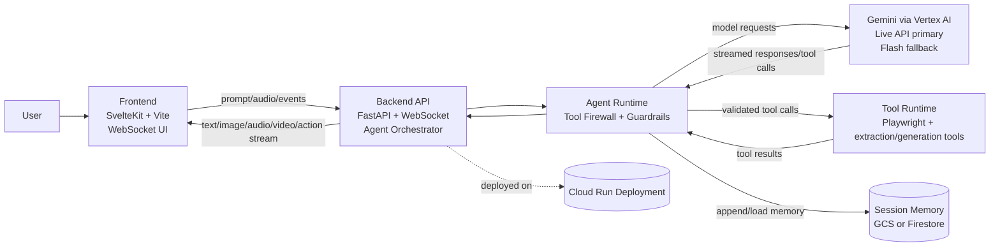

# Aerivon Live V2 - Architecture Diagram

This diagram shows how the frontend, backend, Gemini models, tools, and memory services interact.

## System Diagram

## Data Flow Summary

1. User interacts with the Svelte frontend.
2. Frontend streams requests to FastAPI over WebSocket.
3. Backend invokes Aerivon agent runtime.
4. Agent uses Gemini Live on Vertex AI (with fallback to Gemini Flash).
5. If tools are needed, the tool firewall validates and executes allowed tools.
6. Session memory is loaded/saved through GCS or Firestore.
7. Backend streams multimodal results back to the frontend for live display.

## Judge Quick Access

- Primary diagram file: `ARCHITECTURE_DIAGRAM.md`
- Project summary file: `PROJECT_TEXT_DESCRIPTION.md`
- Backend architecture details: `backend/ARCHITECTURE.md`
